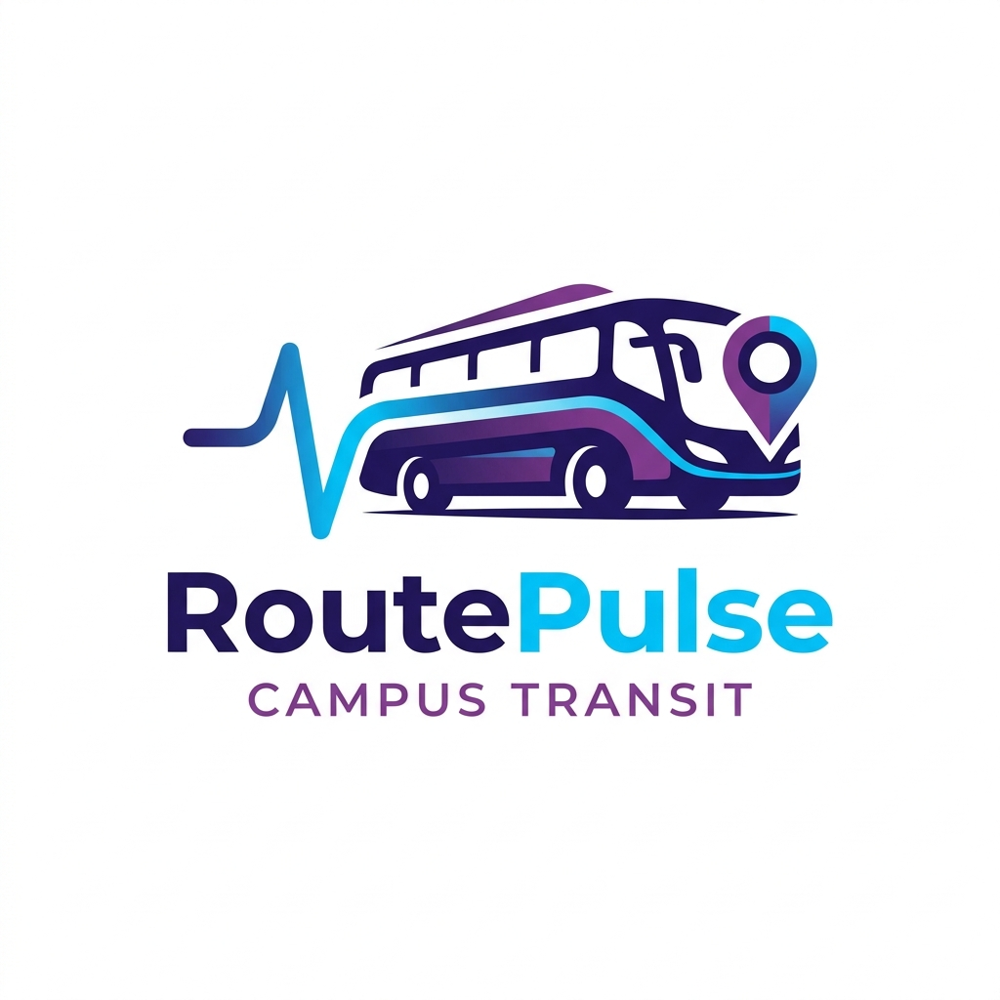
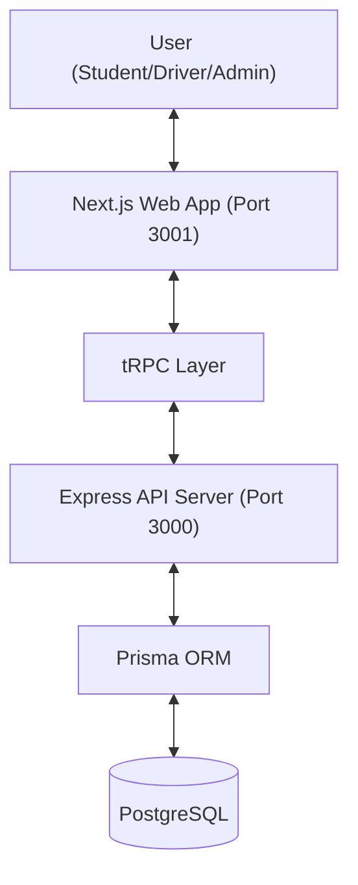

# <p align="center"></p>

# <p align="center">RoutePulse</p>
### <p align="center">**Precision Campus Transit Intelligence**</p>

<p align="center">
  
  
  
  
  
  
  
</p>

---

**RoutePulse** is a next-generation transportation platform designed for modern university ecosystems. It orchestrates high-frequency transit with surgical telemetry, neural path prediction, and a seamless multi-role interface for students, drivers, and administrators.

> [!NOTE]
> **AI-Aided Development**: This project was architected and built with significant assistance from AI, showcasing the future of rapid, high-fidelity application engineering.

## 🚀 Key Features

### 🎓 For Students
- **Real-Time Telemetry**: Track every campus bus with sub-200ms GPS refresh and precise path visualization.
- **Seat Booking**: Secure your spot on upcoming routes through an intuitive booking system.
- **Smart Alerts**: Receive instant notifications for arrivals, delays, and service disruptions.

### 🚛 For Drivers ("Mission Control")
- **Kinetic Interface**: High-performance mobile console optimized for high-pressure transit environments.
- **Shift Orchestration**: Activate shifts, broadcast live telemetry, and manage passenger manifestations in one tap.
- **Route Integrity**: Verified path tracking and incident reporting to ensure network stability.

### 🛰️ For Administrators
- **Fleet Oversight**: A centralized dashboard for monitoring fleet health, driver performance, and ridership analytics.
- **Resource Allocation**: Effortlessly assign drivers to buses and optimize routes based on historical data.
- **System Hardening**: Role-based access control (RBAC) and military-grade security protocols.

---

## 🛠️ Technology Stack

| Layer | Technologies |
| :--- | :--- |
| **Frontend** | Next.js 15, React 19, Framer Motion, HeroUI |
| **Backend** | Express, tRPC v11, Node.js |
| **Database** | PostgreSQL, Prisma ORM |
| **Mapping** | MapLibre GL, React Map GL |
| **Monorepo** | Turborepo, npm Workspaces |
| **Security** | bcrypt, JWT, OWASP-aligned sanitization |

---

## 📐 System Architecture



---

## 🏃 Getting Started

### Prerequisites
- Node.js (v18+)
- npm (v10+)
- PostgreSQL (Local or Cloud instance)

### 1. Clone & Install
```bash
git clone https://github.com/MaybeSurya/routepulse.git
cd routepulse
npm install
```

### 2. Environment Configuration
You'll need to set up environment variables for both the web app and the server. Template files are provided:

**Server (`apps/server/.env`):**
```bash
cp apps/server/.env.example apps/server/.env
# Update DATABASE_URL, JWT_SECRET, SUPABASE, MAILGUN, and R2 credentials.
```

**Web App (`apps/web/.env`):**
```bash
cp apps/web/.env.example apps/web/.env
# Update NEXT_PUBLIC_SERVER_URL and API keys for Maps/Auth.
```

### 3. Database Push
```bash
npm run db:push
```

### 4. Launch Development
```bash
npm run dev
```

---

## 🛡️ Security & Bug Reporting

Reporting issues, bugs, and especially security vulnerabilities is always welcome and encouraged. Help us keep the campus transit ecosystem secure and reliable.

- **Security Vulnerabilities**: Please report directly to [hey@maybesurya.dev](mailto:hey@maybesurya.dev).
- **Bug Reports**: Open an issue on GitHub or email the developer.

---

## 🤝 Contributing
Contributions are welcome! Please read the contribution guidelines before opening a pull request.

## 📄 License
This project is licensed under the MIT License - see the [LICENSE](LICENSE) file for details.

<p align="center">Made with ❤️ by <a href="https://github.com/MaybeSurya">MaybeSurya</a></p>
